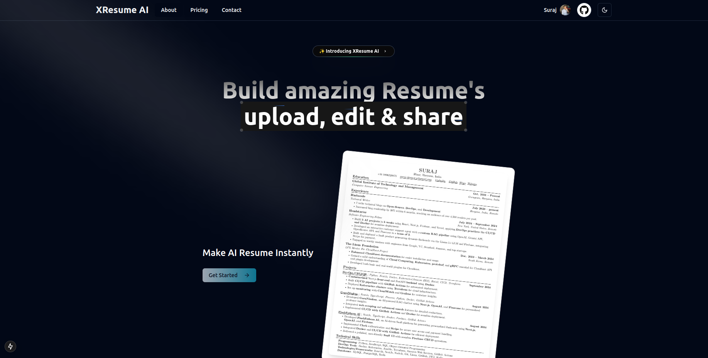

# XResume AI: AI-Powered Resume Generator

XResume AI is an intelligent, user-friendly platform for generating, customizing, and scoring resumes tailored to job descriptions. With AI assistance and powerful customization tools, users can easily optimize their resumes for any job application.



## Features

- **Resume Upload**: Upload your existing resume in PDF or DOCX format.
- **Job Description Upload**: Add job descriptions to tailor your resume to specific roles.
- **AI-Powered Resume Generation**: Generate a resume that aligns with the uploaded job description.
- **Customization Tools**: Edit and customize your resume using a drag-and-drop interface.
- **Resume Scoring**: Get actionable feedback with a comprehensive resume score.

## Tech Stack

- **Frontend**: [Next.js](https://nextjs.org/) (TypeScript)
- **Backend**: [Supabase](https://supabase.com/) and Node.js
- **Database**: PostgreSQL with [Prisma ORM](https://www.prisma.io/)
- **AI**: OpenAI for language processing
- **CI/CD**: GitHub Actions
- **Task Orchestration**: [Kestra](https://kestra.io/)

## Installation

### Prerequisites

- Docker installed on your system.
- Node.js and npm/yarn (for local development).

### Setup with Docker

1. Clone the repository:
   ```bash
   git clone https://github.com/Suraj-kumar00/xresume-ai.git
   cd xresume-ai
   ```
1. Create a `.env` file from the template:

   ```bash
   cp .env.example .env

   ```

1. Update environment variables in the `.env` file.
1. Start the application:

   ```bash
   docker run 'command'

   ```

1. Access the app at http://localhost:3000.

### Local Development

1. Install dependencies:

   ```bash
   npm install

   ```

2. Start the development server:

   ```bash
   npm run dev
   ```

---

## Kestra Integration

To use Kestra for managing complex workflows like resume generation, scoring, and AI model interaction:

1. Install Kestra:
   - Follow the installation guide: Kestra Documentation.
2. Define workflows for resume generation and scoring in the `kestra/` directory:

   - Example workflow:

     ```yaml
     id: generate-resume
     namespace: resumegen
     tasks:
       - id: upload-resume
         type: io.kestra.task.upload.file
         properties:
           - key: resume
             value: "{{inputs.resume}}"

     ```

3. Start the Kestra server and execute workflows as needed.

---

## 🤝 Contributing

For more details, check out the [CONTRIBUTING.md](/CONTRIBUTING.md) file.

## 📜 License

This project is licensed under the [MIT License](https://github.com/Suraj-kumar00/xresume-ai/blob/main/LICENSE).

## 🌟 Show Your Support

If you like the project, please give it a ⭐️ on [GitHub](https://github.com/Suraj-kumar00/xresume-ai)!
